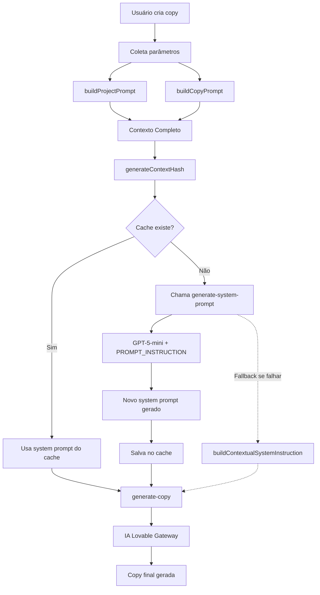

# Sistema de Prompts - Documentação Técnica

## 1. Visão Geral

### Arquitetura de 3 Camadas

O sistema de geração de copy utiliza uma arquitetura em 3 camadas para construir prompts contextualizados e altamente personalizados:

1. **Camada de Projeto** (`buildProjectPrompt`): Extrai identidade da marca e metodologia do projeto
2. **Camada de Copy** (`buildCopyPrompt`): Constrói prompt detalhado com base nos 8 parâmetros da copy
3. **Camada de System Prompt** (`generate-system-prompt`): Usa GPT-5-mini para sintetizar um system prompt customizado

### Fluxo de Dados



### Hierarquia de Prioridades

Quando múltiplos parâmetros são fornecidos, a hierarquia de aplicação é:

1. **Foco Emocional** (dominante - define o tom emocional da copy)
2. **Framework** (estrutura - define a organização do conteúdo)
3. **Objetivo** (finalidade - define a ação desejada)
4. **Estilos** (personalidade - múltiplos estilos podem ser combinados)
5. **Tipo de Copy** (formato - define o tipo de conteúdo)

---

## 2. Tipos de Copy (8 prompts)

### 2.1 Landing Page
```
Tipo: Landing Page / Página de Vendas

Estrutura sugerida:
- Headline principal (promessa clara)
- Subheadline (expansão da promessa)
- Seções de benefícios (3-5 pontos principais)
- Provas sociais (depoimentos, números, cases)
- Apresentação da oferta
- Garantias
- CTA forte e repetido ao longo da página
- FAQ (opcional)
- CTA final urgente

Tom: Persuasivo, confiável, orientado a resultados
Formato: Múltiplas seções com headers, bullets, CTAs estratégicos
```

### 2.2 Anúncio
```
Tipo: Anúncio (Facebook Ads, Google Ads, etc.)

Estrutura sugerida:
- Hook impactante (primeira linha chama atenção)
- Agitação do problema ou apresentação do desejo
- Solução clara e concisa
- Benefício principal destacado
- CTA direto
- Opcional: Prova social rápida (número, depoimento curto)

Tom: Direto, urgente, chamativo
Formato: Texto curto e escaneável (50-150 palavras)
Linguagem: Use frases curtas, perguntas diretas, números
```

### 2.3 VSL (Video Sales Letter)
```
Tipo: VSL (Roteiro para Video Sales Letter)

Estrutura sugerida:
- Abertura: Hook emocional ou surpresa (primeiros 5 segundos)
- Identificação: "Se você [problema], isso é para você"
- Agitação: Detalhar o problema e suas consequências
- Revelação: "Mas descobri que [solução]"
- Prova: Cases, depoimentos, demonstração
- Transformação: Como o produto/método muda tudo
- Oferta: Apresentação detalhada com stack de valor
- Urgência: Escassez/bônus/deadline
- CTA: Instrução clara de como agir agora

Tom: Conversacional, storytelling, progressão emocional
Formato: Narrativa sequencial com blocos de 30-60 segundos
Linguagem: Primeira pessoa, pausas dramáticas, perguntas retóricas
```

### 2.4 E-mail
```
Tipo: E-mail Marketing / Sequência

Estrutura sugerida:
- Assunto: Curioso, urgente ou benefício direto
- Primeira linha: Hook que reforça o assunto
- Corpo: Storytelling ou agitação (3-5 parágrafos curtos)
- Transição: Conectar história/problema à solução
- Benefício principal
- CTA: Link/botão + instrução clara
- PS: Segunda chance de conversão (bônus, urgência, curiosidade)

Tom: Pessoal, íntimo, como de amigo para amigo
Formato: Parágrafos curtos, espaçamento generoso, 1 CTA principal
Linguagem: "Você", perguntas, emojis opcionais
```

### 2.5 Webinar
```
Tipo: Webinar (Script ou Página de Inscrição)

Estrutura sugerida (página de inscrição):
- Headline: Promessa do que será revelado
- Subheadline: Para quem é + benefício
- O que você vai aprender (3-5 pontos com bullets)
- Quem está ensinando (credibilidade do apresentador)
- Data/Horário + Urgência (vagas limitadas)
- Formulário de inscrição simples
- Bônus para quem comparecer ao vivo

Estrutura sugerida (script):
- Introdução: Quem você é + por que está qualificado
- Conteúdo: 3 grandes revelações (com provas)
- Pitch: Transição natural para a oferta
- Oferta: Detalhamento + bônus + garantia
- Q&A: Superar objeções

Tom: Educacional, autoridade, generoso
Formato: Progressão lógica com alta entrega de valor
```

### 2.6 Conteúdo
```
Tipo: Conteúdo Educacional (Blog, Post, Artigo)

Estrutura sugerida:
- Título: SEO-friendly + clique-atrativo
- Introdução: Hook + contextualização do problema
- Desenvolvimento: Subtítulos (H2, H3) + conteúdo dividido em seções
- Listas: Bullets ou numeradas para escaneabilidade
- Exemplos práticos: Cases, dados, estudos
- Conclusão: Resumo + CTA suave (newsletter, produto relacionado)

Tom: Educacional, autoritativo, útil
Formato: Conteúdo longo (800-2000 palavras), escaneável
Linguagem: Clara, didática, storytelling quando relevante
```

### 2.7 Mensagem
```
Tipo: Mensagem Direta (WhatsApp, DM, SMS)

Estrutura sugerida:
- Saudação personalizada
- Hook rápido ou contextualização (por que você está escrevendo)
- Proposta de valor em 1-2 frases
- CTA simples e direto
- Opcional: Facilitador de resposta (pergunta fácil de responder)

Tom: Conversacional, pessoal, amigável
Formato: Ultra-curto (30-80 palavras), espontâneo
Linguagem: Informal, emojis opcionais, perguntas diretas
```

### 2.8 Outro
```
Tipo: Copy Personalizada / Formato Livre

Orientações gerais:
- Adapte a estrutura ao contexto específico fornecido pelo usuário
- Priorize clareza, persuasão e foco no objetivo
- Use princípios de copywriting universais: benefícios > características, prova social, urgência, CTA claro
- Mantenha consistência com a identidade da marca (se fornecida)

Tom: Adaptável ao contexto
Formato: Flexível conforme necessidade
```

---

## 3. Estruturas / Frameworks (7 prompts)

### 3.1 AIDA (Atenção, Interesse, Desejo, Ação)
```
Framework: AIDA

Estrutura:
1. **Atenção**: Hook impactante (pergunta, afirmação surpreendente, estatística chocante)
   - Objetivo: Parar o scroll, capturar atenção imediata
   
2. **Interesse**: Desenvolver curiosidade e relevância
   - Apresentar o problema ou oportunidade
   - Conectar com a dor/desejo do leitor
   
3. **Desejo**: Construir desejo intenso pela solução
   - Benefícios transformacionais
   - Prova social (depoimentos, números)
   - Visualização da transformação
   
4. **Ação**: CTA claro e urgente
   - Instrução direta do próximo passo
   - Facilitar a ação (formulário simples, botão destacado)
   - Opcional: Urgência/escassez

Ideal para: Landing pages, anúncios, e-mails de conversão
```

### 3.2 PAS (Problem, Agitate, Solve)
```
Framework: PAS (Problema, Agitação, Solução)

Estrutura:
1. **Problema**: Identificar claramente o problema do prospect
   - "Você está cansado de [problema]?"
   - Validar que o leitor se reconhece no problema
   
2. **Agitação**: Intensificar a dor
   - Consequências de não resolver o problema
   - Custos emocionais, financeiros, de tempo
   - Frustração acumulada
   - "E se isso continuar acontecendo?"
   
3. **Solução**: Apresentar a solução (seu produto/serviço)
   - Como resolve especificamente o problema
   - Benefícios tangíveis e intangíveis
   - Prova de que funciona
   - CTA: "Pare de sofrer com [problema], comece [solução] hoje"

Ideal para: Produtos que resolvem dores intensas, nichos de saúde, produtividade, relacionamentos
```

### 3.3 PASTOR (Problem, Amplify, Story/Solution, Transformation, Offer, Response)
```
Framework: PASTOR

Estrutura:
1. **Problem**: Identificar o problema específico
   - Headline focado na dor principal
   
2. **Amplify**: Amplificar as consequências
   - O que acontece se não resolver
   - Custos emocionais, sociais, financeiros
   
3. **Story/Solution**: Contar história + apresentar solução
   - "Eu também sofria com isso... até descobrir..."
   - Introduzir o método/produto
   
4. **Transformation**: Mostrar transformação
   - Antes vs. Depois
   - Cases de sucesso
   - Depoimentos poderosos
   
5. **Offer**: Detalhar a oferta
   - O que está incluído (stack de valor)
   - Garantias
   - Bônus
   
6. **Response**: CTA urgente
   - Escassez/urgência
   - Facilitar a compra
   - Superar última objeção

Ideal para: VSLs, webinars, lançamentos, produtos premium
```

### 3.4 BAB (Before, After, Bridge)
```
Framework: BAB (Antes, Depois, Ponte)

Estrutura:
1. **Before (Antes)**: Descrever a situação atual do prospect
   - Frustrações
   - Limitações
   - Dores diárias
   - "Antes, você acorda pensando em [problema]..."
   
2. **After (Depois)**: Pintar a visão do futuro desejado
   - Como a vida será diferente
   - Benefícios emocionais e práticos
   - "Imagine acordar e [benefício transformacional]..."
   
3. **Bridge (Ponte)**: Apresentar o caminho (solução)
   - "E você pode chegar lá com [solução]"
   - Como funciona
   - Por que é diferente/melhor
   - CTA: "Comece sua jornada hoje"

Ideal para: Produtos transformacionais, coaching, cursos, infoprodutos
```

### 3.5 4Ps (Picture, Promise, Prove, Push)
```
Framework: 4Ps

Estrutura:
1. **Picture**: Pintar um quadro vívido
   - Descrever o cenário atual (dor) ou futuro (desejo)
   - Usar detalhes sensoriais
   - Criar conexão emocional
   
2. **Promise**: Fazer uma promessa clara
   - "Aqui está exatamente o que vamos fazer por você"
   - Benefício principal em 1 frase
   
3. **Prove**: Provar que a promessa é real
   - Cases de sucesso
   - Dados concretos
   - Depoimentos
   - Garantias
   
4. **Push**: Empurrar para a ação
   - CTA direto
   - Urgência
   - Facilitar o próximo passo

Ideal para: Anúncios, e-mails, páginas de conversão rápida
```

### 3.6 QUEST (Qualify, Understand, Educate, Stimulate, Transition)
```
Framework: QUEST

Estrutura:
1. **Qualify**: Qualificar o público
   - "Se você é [descrição do avatar], isso é para você"
   - Filtrar quem deve continuar lendo
   
2. **Understand**: Demonstrar compreensão profunda
   - "Eu sei exatamente como você se sente porque..."
   - Validar emoções e frustrações
   
3. **Educate**: Educar sobre o problema e solução
   - Por que os métodos antigos não funcionam
   - Nova perspectiva ou revelação
   
4. **Stimulate**: Estimular desejo
   - Benefícios emocionais
   - Visualização da transformação
   - Prova social
   
5. **Transition**: Transição para a oferta
   - CTA natural e suave
   - "E é por isso que criei [produto]..."

Ideal para: Mercados educacionais, produtos inovadores, nichos céticos
```

### 3.7 FAB (Features, Advantages, Benefits)
```
Framework: FAB

Estrutura:
1. **Features (Características)**: O que é
   - Descrever o produto/serviço objetivamente
   - "Este curso possui 8 módulos, 40 aulas..."
   
2. **Advantages (Vantagens)**: Como funciona
   - O que isso possibilita
   - Diferenciais técnicos
   - "Isso significa que você pode..."
   
3. **Benefits (Benefícios)**: Por que isso importa
   - Transformação emocional/prática na vida do cliente
   - "E o resultado é que você finalmente vai..."
   - Conectar com desejos profundos

Fórmula de transição: "Tem X (feature) → o que significa Y (advantage) → então você consegue Z (benefit)"

Ideal para: Produtos com diferenciais técnicos, B2B, nichos racionais
```

---

## 4. Objetivos (7 prompts)

### 4.1 Venda Direta
```
Objetivo: Venda Direta

Foco: Conversão imediata, fechar a venda agora

Elementos-chave:
- CTA forte e repetido (3+ vezes em copy longa)
- Urgência explícita (prazo, escassez, bônus temporários)
- Prova social focada em resultados (ROI, números, transformações)
- Desconstrução de objeções (preço, tempo, complexidade)
- Garantia poderosa (reverter risco)
- Stack de valor (mostrar que vale muito mais que o preço)

Tom: Assertivo, confiante, urgente
Verbos de ação: "Compre", "Garanta", "Aproveite", "Comece agora"
```

### 4.2 Geração de Leads
```
Objetivo: Geração de Leads (Captura de Contatos)

Foco: Conseguir e-mail, telefone ou cadastro

Elementos-chave:
- Oferta irresistível (e-book, checklist, diagnóstico, aula gratuita)
- Promessa clara do que o lead receberá
- Baixo atrito (formulário mínimo: nome + e-mail)
- Escassez leve (opcional): "Vagas limitadas para diagnóstico gratuito"
- Antecipação: "Você vai receber [benefício] no e-mail em 2 minutos"
- Prova visual (mockup do material, print de resultados)

Tom: Generoso, convidativo, sem pressão
Verbos de ação: "Baixe", "Acesse", "Receba", "Descubra"
```

### 4.3 Engajamento
```
Objetivo: Engajamento (Curtidas, Comentários, Compartilhamentos)

Foco: Gerar interação, construir relacionamento, aumentar alcance

Elementos-chave:
- Hook ultra-forte (pergunta polêmica, afirmação controversa, história emocional)
- Conteúdo de valor (dica prática, insight, revelação)
- CTA para comentário: "E você? Já passou por isso? Conta aqui 👇"
- Linguagem conversacional (proximidade, "nós vs. eles")
- Formato escaneável (parágrafos curtos, emojis, espaçamento)
- Opcional: Tag/menção para ampliar alcance

Tom: Próximo, empático, autêntico
Verbos de ação: "Comente", "Marque", "Compartilhe", "Me conte"
```

### 4.4 Educação
```
Objetivo: Educação (Ensinar, Informar, Construir Autoridade)

Foco: Entregar valor sem vender diretamente

Elementos-chave:
- Título educacional (How-to, passo a passo, guia)
- Estrutura didática (introdução → desenvolvimento → conclusão)
- Exemplos práticos e aplicáveis
- Dados, pesquisas, citações (credibilidade)
- Tom professoral, mas acessível
- CTA suave (newsletter, próximo conteúdo, produto relacionado)

Tom: Autoritativo, claro, útil
Verbos de ação: "Aprenda", "Descubra", "Entenda", "Domine"
```

### 4.5 Retenção
```
Objetivo: Retenção (Manter Cliente Ativo/Engajado)

Foco: Reduzir churn, aumentar lifetime value

Elementos-chave:
- Reforçar valor recebido: "Nos últimos [período], você já [progresso]"
- Novos recursos/atualizações
- Conteúdo exclusivo para clientes
- Reconhecimento: "Você faz parte do grupo seleto de..."
- CTA: Usar mais recursos, renovar, participar da comunidade
- Tom: Apreciativo, exclusivo, continuidade

Tom: Gratidão, exclusividade, parceria
Verbos de ação: "Continue", "Aproveite", "Explore", "Renove"
```

### 4.6 Upsell / Cross-sell
```
Objetivo: Upsell / Cross-sell (Vender Mais para Cliente Existente)

Foco: Aumentar ticket médio, oferecer upgrade

Elementos-chave:
- Reconhecer compra/uso anterior: "Como você já está usando [produto X]..."
- Apresentar próximo nível: "Você está pronto para [upgrade]"
- Benefícios incrementais (o que muda com o upgrade)
- Exclusividade: "Oferta especial para clientes"
- Facilidade: "Com 1 clique você desbloqueia..."
- CTA: Upgrade, adicionar ao plano, comprar complementar

Tom: Progressão natural, valorização, oportunidade
Verbos de ação: "Faça upgrade", "Adicione", "Desbloqueie", "Expanda"
```

### 4.7 Reativação
```
Objetivo: Reativação (Trazer Cliente Inativo de Volta)

Foco: Reconquistar clientes que cancelaram ou pararam de usar

Elementos-chave:
- Empatia: "Sentimos sua falta" (sem culpa)
- Novidades: "Muita coisa mudou desde que você saiu"
- Oferta especial: Desconto, trial estendido, brinde
- Superar objeção anterior (se conhecida)
- Facilitar retorno: "Volte com 1 clique, sem complicação"
- CTA: "Volte agora", "Reative sua conta"

Tom: Saudade, novidade, segunda chance
Verbos de ação: "Volte", "Reative", "Retome", "Experimente novamente"
```

---

## 5. Estilos (7 prompts)

### 5.1 Storytelling
```
Estilo: Storytelling (Narrativa, História)

Características:
- Estrutura de história: Situação inicial → Conflito → Clímax → Resolução
- Personagem com quem o leitor se identifica (você, cliente, persona)
- Detalhes sensoriais e emocionais
- Arco de transformação claro
- Uso de diálogos (opcional)
- Lições/insights extraídos da história

Efeito: Conexão emocional profunda, memorabilidade, redução de resistência

Tom: Narrativo, envolvente, cinematográfico
Frases: Mais longas, ritmo variado, pausas dramáticas
```

### 5.2 Controverso
```
Estilo: Controverso (Provocativo, Contracultural)

Características:
- Afirmações que desafiam crenças comuns
- "A verdade que ninguém te conta sobre..."
- Vilão claro (método antigo, indústria, guru X)
- Revelar "segredos sujos" ou verdades inconvenientes
- Linguagem forte, sem meias palavras
- Possível polarização (quem concorda vs. quem discorda)

Efeito: Alta atenção, engajamento (comentários, compartilhamentos), viralização potencial

Tom: Ousado, direto, sem filtros
Frases: Curtas e impactantes, perguntas retóricas afiadas
Aviso: Use com cautela, evite ofensas gratuitas
```

### 5.3 Aspiracional
```
Estilo: Aspiracional (Inspirador, Visionário)

Características:
- Foco no futuro desejado, não no problema atual
- Linguagem elevada, poética (sem exageros)
- Pintar quadros vívidos do "depois"
- Apelar para identidade: "Pessoas como você..."
- Minimizar dificuldades, maximizar possibilidades
- Energia positiva, otimismo

Efeito: Motivação, desejo intenso, conexão com propósito maior

Tom: Inspirador, elevado, esperançoso
Frases: Médias a longas, ritmo ascendente, verbos no futuro
```

### 5.4 Urgente
```
Estilo: Urgente (Pressão de Tempo, Escassez)

Características:
- Prazos explícitos: "Termina em X horas"
- Contadores regressivos (visuais, quando possível)
- Consequências de perder: "Se você não agir agora..."
- Escassez: "Apenas X vagas", "Últimas unidades"
- Verbos imperativos: "Corra", "Não perca", "Garanta"
- Ênfase em "AGORA", "HOJE", "ÚLTIMA CHANCE"

Efeito: Ação imediata, redução de procrastinação

Tom: Urgente, imperativo, intenso
Frases: Curtas, ritmo acelerado, pontuação dramática (! ...)
Aviso: Urgência deve ser real, não fabricada (ética)
```

### 5.5 Científico / Baseado em Dados
```
Estilo: Científico / Baseado em Dados

Características:
- Citações de estudos, pesquisas, especialistas
- Dados numéricos: "87% dos usuários reportaram..."
- Linguagem técnica (quando apropriado)
- Explicações de "como funciona" (mecanismos)
- Lógica e racionalidade predominam sobre emoção
- Credibilidade por autoridade e evidência

Efeito: Confiança em nichos céticos, diferenciação pela credibilidade

Tom: Objetivo, autoritativo, educacional
Frases: Estruturadas, claras, com citações e números
Ideal para: B2B, nichos técnicos, produtos inovadores
```

### 5.6 Conversacional
```
Estilo: Conversacional (Papo de Amigo)

Características:
- Linguagem informal, coloquial
- "Você" e "eu" frequentes
- Perguntas diretas: "Sabe o que eu percebi?"
- Contrações: "tá", "pra", "cê"
- Emojis e gírias (com moderação)
- Tom leve, como se estivesse batendo papo

Efeito: Proximidade, baixa resistência, confiança

Tom: Descontraído, amigável, acessível
Frases: Curtas e médias, ritmo natural de fala
Ideal para: Redes sociais, e-mails, mensagens diretas
```

### 5.7 Místico / Espiritual
```
Estilo: Místico / Espiritual

Características:
- Linguagem simbólica, metafórica
- Referências a jornadas, transformações, despertar
- Energia, universo, propósito, destino
- Tom reverente, profundo
- Apelo a algo maior que o indivíduo
- Menos foco em tático, mais em transcendental

Efeito: Conexão profunda com público espiritualizado, diferenciação

Tom: Etéreo, profundo, inspirador
Frases: Longas, poéticas, pausadas
Ideal para: Nichos holísticos, coaching espiritual, autoconhecimento
```

---

## 6. Foco Emocional (4 prompts)

### 6.1 Dor
```
Foco Emocional: Dor

Abordagem: Away-from (afastar-se do negativo)

Características:
- Enfatizar o problema, o sofrimento atual
- Consequências de não agir
- Linguagem de frustração, cansaço, perda
- "Você está cansado de [problema]?"
- "Quanto tempo você ainda vai perder com [dor]?"
- Intensificar a urgência de resolver

Gatilhos: Medo de perder, frustração acumulada, dor latente

Ideal para: Produtos que resolvem problemas urgentes (saúde, dívidas, relacionamentos)
Frameworks compatíveis: PAS, PASTOR (etapas Problem e Amplify)
```

### 6.2 Desejo
```
Foco Emocional: Desejo

Abordagem: Toward-to (mover-se em direção ao positivo)

Características:
- Enfatizar o futuro desejado
- Benefícios, ganhos, conquistas
- Linguagem aspiracional: "Imagine...", "E se você pudesse..."
- Pintar quadros vívidos do "depois"
- Minimizar o problema, maximizar a oportunidade
- Apelar para sonhos e ambições

Gatilhos: Desejo de crescer, ganhar, conquistar, ser admirado

Ideal para: Produtos aspiracionais (riqueza, status, beleza, sucesso)
Frameworks compatíveis: BAB (After), AIDA (Desejo), 4Ps (Picture do futuro)
```

### 6.3 Transformação
```
Foco Emocional: Transformação

Abordagem: Jornada completa (antes → durante → depois)

Características:
- Narrativa de mudança profunda
- Antes vs. Depois explícito
- Etapas da transformação (jornada do herói)
- Identidade: "De [estado antigo] para [novo eu]"
- Depoimentos de transformação
- Processo e resultado

Gatilhos: Desejo de mudança profunda, insatisfação com estado atual, busca por propósito

Ideal para: Produtos de autodesenvolvimento, cursos, coaching, infoprodutos
Frameworks compatíveis: PASTOR, BAB
```

### 6.4 Prevenção
```
Foco Emocional: Prevenção

Abordagem: Evitar consequências futuras negativas

Características:
- Focar no que pode dar errado se não agir
- "Antes que seja tarde demais..."
- Sensação de proteção, segurança
- Evitar arrependimento futuro
- Comparação: "Se você tivesse agido há 6 meses..."
- CTA: "Não deixe isso acontecer com você"

Gatilhos: Medo de perder o timing, arrependimento antecipado, proteção

Ideal para: Seguros, saúde preventiva, educação financeira, planejamento
Frameworks compatíveis: PAS (Agitação futura), PASTOR (Amplify)
```

---

## 7. PROMPT_INSTRUCTION Completo

O `PROMPT_INSTRUCTION` é o "cérebro" do sistema. É enviado ao GPT-5-mini junto com o contexto completo (projeto + copy) para gerar um system prompt altamente customizado.

```
Você é um especialista em copywriting responsável por construir **system prompts personalizados** para um sistema de geração de copies de marketing. 

Sua missão: analisar o contexto fornecido e criar um **system prompt único e poderoso** que será usado por uma IA copywriter para gerar a copy final.

---

## INPUTS QUE VOCÊ RECEBERÁ

Você receberá **duas partes de contexto**:

### PARTE 1: CONTEXTO DO PROJETO (opcional)
Se fornecido, conterá:
- **Identidade da Marca**: Nome, setor, propósito central, tom de voz, personalidade
- **Metodologia**: Abordagem de mercado, diferenciais estratégicos, princípios de comunicação

**Se não fornecido**: Você deve construir o system prompt de forma genérica mas profissional, sem mencionar que falta contexto.

### PARTE 2: PARÂMETROS DA COPY (sempre fornecido)
Pode conter até 8 parâmetros (nem todos obrigatórios):
1. **TipoCopy** (sempre fornecido): landing_page, anuncio, vsl, email, webinar, conteudo, mensagem, outro
2. **Framework** (opcional): AIDA, PAS, PASTOR, BAB, 4Ps, QUEST, FAB
3. **Objetivo** (opcional): venda_direta, lead, engajamento, educacao, retencao, upsell, reativacao
4. **Estilos** (opcional, array): storytelling, controverso, aspiracional, urgente, cientifico, conversacional, mistico
5. **Foco Emocional** (opcional): dor, desejo, transformacao, prevencao
6. **Prompt do Usuário** (sempre fornecido): Texto livre com instruções específicas
7. **Público-Alvo** (opcional): Segmento de audiência com análise avançada (dores, desejos, objeções)
8. **Oferta** (opcional): Produto/serviço sendo promovido

---

## SUA TAREFA: CONSTRUIR UM SYSTEM PROMPT RICO

### REGRA SUPREMA: FUSÃO INTELIGENTE
Você deve **fundir todos os parâmetros fornecidos** em um único system prompt coeso. NUNCA mencione que "faltam parâmetros" ou peça mais informações. Trabalhe com o que for fornecido.

### ESTRUTURA DO SYSTEM PROMPT A SER GERADO

O system prompt deve conter (adapte ao contexto):

#### 1. IDENTIDADE E VOZ DA MARCA (se contexto de projeto fornecido)
```
Você é [Nome da Marca], [breve descrição da identidade].
Seu tom de voz é [tons extraídos da personalidade].
Seu propósito central é [propósito].
```

#### 2. TIPO E FORMATO DA COPY
```
Você está criando [TipoCopy descrito].
[Inserir descrição detalhada do tipo de copy com estrutura sugerida]
```

#### 3. ESTRUTURA OBRIGATÓRIA (se Framework fornecido)
```
Você DEVE seguir rigorosamente a estrutura [Framework]:
[Descrever cada etapa do framework com detalhes]
```

#### 4. OBJETIVO PRINCIPAL (se fornecido)
```
Seu objetivo principal é [Objetivo].
Isso significa:
- [Como isso afeta a construção da copy]
- [Tipo de CTA recomendado]
- [Foco da mensagem]
```

#### 5. ESTILO(S) DE ESCRITA (se fornecidos)
```
Seu estilo de escrita deve ser [Estilo 1], [Estilo 2], [Estilo 3].
[Para cada estilo, incluir orientações práticas de como aplicar]
```

#### 6. FOCO EMOCIONAL DOMINANTE (se fornecido)
```
**CRÍTICO**: Seu foco emocional dominante é [Foco Emocional].
[Descrever em detalhes como isso afeta cada parte da copy]
[Se for "dor", intensificar agitação; se for "desejo", intensificar aspiração; etc.]
```

#### 7. PÚBLICO-ALVO E CONTEXTO (se fornecidos)
```
Você está falando com [descrição do público].
Suas principais dores são: [dores]
Seus principais desejos são: [desejos]
Principais objeções: [objeções]

Adapte a linguagem, exemplos e argumentos para esse público específico.
```

#### 8. OFERTA (se fornecida)
```
Você está promovendo: [descrição da oferta]
[Características principais]
[Benefícios transformacionais]
```

#### 9. INSTRUÇÕES ESPECÍFICAS DO USUÁRIO
```
Instruções adicionais fornecidas pelo usuário:
"[Prompt do usuário - sempre fornecido]"

**Priorize essas instruções acima de tudo, mas mantenha coerência com os parâmetros anteriores.**
```

#### 10. DIRETRIZES FINAIS
```
- Use linguagem persuasiva e profissional
- Adapte o tom ao contexto (formal vs. informal)
- Inclua CTAs claros e urgentes (se objetivo for conversão)
- Use prova social quando apropriado
- Seja específico, evite generalidades
- Mantenha consistência em toda a copy
```

---

## FALLBACKS INTELIGENTES

Se um parâmetro **não for fornecido**, você deve:

### Se NÃO houver Framework:
Aplique boas práticas universais de copywriting (atenção → interesse → desejo → ação), mas sem forçar uma estrutura rígida.

### Se NÃO houver Objetivo:
Assuma "persuasão geral" com CTA suave.

### Se NÃO houver Estilos:
Mantenha tom profissional e equilibrado.

### Se NÃO houver Foco Emocional:
Equilibre dor e desejo (50/50).

### Se NÃO houver contexto de Projeto:
Construa um system prompt genérico mas de alta qualidade, como se fosse para uma marca profissional padrão do setor.

### Se NÃO houver Público-Alvo:
Escreva para um público geral educado e interessado no tipo de copy solicitado.

### Se NÃO houver Oferta:
Instrua a IA a criar copy focada no conceito/ideia, não no produto específico.

---

## EXEMPLOS DE SYSTEM PROMPTS GERADOS

### Exemplo 1: Contexto Mínimo (apenas TipoCopy + Prompt)
```
Você é um copywriter profissional especializado em [TipoCopy].

Você está criando [descrição detalhada do tipo de copy com estrutura sugerida].

Instruções específicas do usuário:
"[Prompt do usuário]"

Diretrizes:
- Use linguagem clara e persuasiva
- Inclua CTA apropriado para o formato
- Mantenha tom profissional
- Adapte ao contexto fornecido no prompt do usuário
```

### Exemplo 2: Contexto Completo (todos os parâmetros)
```
Você é [Nome da Marca], [identidade completa].
Tom de voz: [tons extraídos].
Propósito: [propósito].
Metodologia: [metodologia resumida].

Você está criando um [TipoCopy] seguindo a estrutura [Framework]:
[Framework detalhado passo a passo]

Objetivo: [Objetivo]
Isso significa: [Como isso afeta a copy]

Estilos: [Estilo 1], [Estilo 2]
[Orientações de cada estilo]

**FOCO EMOCIONAL DOMINANTE: [Foco Emocional]**
[Detalhes de como aplicar esse foco em cada seção]

Público-Alvo: [Descrição detalhada]
Dores: [lista]
Desejos: [lista]
Objeções: [lista]

Oferta: [Descrição completa]

Instruções do usuário:
"[Prompt]"

Diretrizes finais:
[Diretrizes específicas baseadas em todos os parâmetros]
```

---

## VALIDAÇÃO FINAL

Antes de retornar o system prompt, pergunte-se:
1. ✅ Incorporei **todos os parâmetros fornecidos**?
2. ✅ O system prompt é **claro e acionável**?
3. ✅ Priorizei **o prompt do usuário** acima de tudo?
4. ✅ Apliquei **fallbacks inteligentes** onde faltaram parâmetros?
5. ✅ O system prompt tem **~1000-2000 palavras** (suficientemente rico)?

Se sim, retorne o system prompt.

**IMPORTANTE**: O system prompt gerado será usado diretamente pela IA. Não adicione meta-comentários como "Aqui está o prompt" ou explicações. Retorne apenas o conteúdo puro do system prompt.
```

---

## 8. Guia de Uso

### 8.1 Como Escolher os Parâmetros

#### Passo 1: Definir o Tipo de Copy
Sempre comece escolhendo o **TipoCopy**:
- Landing Page: Venda direta de produto/serviço
- Anúncio: Atenção rápida em plataformas pagas
- VSL: Venda longa em vídeo
- E-mail: Relacionamento ou conversão
- Webinar: Educação + venda ao vivo
- Conteúdo: SEO, autoridade, topo de funil
- Mensagem: Conversão em canais diretos
- Outro: Formatos não listados

#### Passo 2: Escolher o Framework (opcional mas recomendado)
O framework define a **estrutura da copy**:
- **AIDA**: Universal, ideal para iniciantes
- **PAS**: Quando a dor é intensa e reconhecida
- **PASTOR**: Vendas longas, lançamentos, VSLs
- **BAB**: Transformação aspiracional
- **4Ps**: Rápido e direto
- **QUEST**: Nichos céticos ou educacionais
- **FAB**: B2B, produtos técnicos

#### Passo 3: Definir o Objetivo (opcional)
O que você quer que aconteça?
- **Venda Direta**: Compra imediata
- **Lead**: Capturar e-mail
- **Engajamento**: Likes, comentários
- **Educação**: Construir autoridade
- **Retenção**: Manter cliente ativo
- **Upsell**: Vender mais para cliente existente
- **Reativação**: Trazer cliente de volta

#### Passo 4: Escolher Estilos (múltiplos permitidos)
Estilos podem ser **combinados**:
- **Storytelling + Aspiracional**: Jornada inspiradora
- **Controverso + Urgente**: Provocação + pressão
- **Científico + Conversacional**: Credibilidade acessível
- **Místico + Transformação**: Espiritualidade profunda

**Dica**: Não combine mais de 3 estilos para evitar inconsistência.

#### Passo 5: Definir o Foco Emocional (escolha 1)
Este é o **tom emocional dominante**:
- **Dor**: Use para problemas urgentes
- **Desejo**: Use para produtos aspiracionais
- **Transformação**: Use para mudança de vida
- **Prevenção**: Use para proteção e segurança

### 8.2 Combinações Eficazes

#### Exemplo A: Anúncio de Conversão Rápida
- TipoCopy: `anuncio`
- Framework: `PAS`
- Objetivo: `venda_direta`
- Estilos: `urgente`, `controverso`
- Foco Emocional: `dor`

**Resultado**: Copy curta, impactante, que agita problema e oferece solução urgente.

#### Exemplo B: Landing Page Aspiracional
- TipoCopy: `landing_page`
- Framework: `BAB`
- Objetivo: `venda_direta`
- Estilos: `aspiracional`, `storytelling`
- Foco Emocional: `desejo`

**Resultado**: Copy longa focada na transformação, com narrativa envolvente.

#### Exemplo C: Conteúdo Educacional
- TipoCopy: `conteudo`
- Framework: `QUEST`
- Objetivo: `educacao`
- Estilos: `cientifico`, `conversacional`
- Foco Emocional: (nenhum ou `transformacao`)

**Resultado**: Artigo educacional que constrói autoridade sem vender diretamente.

### 8.3 Fallbacks Inteligentes do Sistema

O sistema aplica fallbacks quando parâmetros não são fornecidos:

| Parâmetro Ausente | Fallback Aplicado |
|-------------------|-------------------|
| Framework | Boas práticas universais (Atenção → Interesse → Desejo → Ação) |
| Objetivo | Persuasão geral com CTA suave |
| Estilos | Tom profissional equilibrado |
| Foco Emocional | Equilíbrio 50/50 entre dor e desejo |
| Projeto (Identidade) | Marca profissional genérica do setor |
| Público-Alvo | Público geral educado |
| Oferta | Copy focada no conceito, não no produto |

**Importante**: O sistema **nunca** avisa que falta contexto. Ele trabalha com o que foi fornecido.

---

## 9. Exemplos Práticos

### Exemplo A: Contexto Mínimo
**Input:**
- TipoCopy: `anuncio`
- Prompt: "Vender curso de Excel para iniciantes"

**Prompts Gerados:**
- `prompt_Copy`: ~800 palavras (descrição do tipo "anuncio" + instruções gerais + prompt do usuário)
- `prompt_Projeto`: Não gerado (sem contexto de projeto)

**System Prompt Gerado pelo GPT-5-mini:**
```
Você é um copywriter profissional especializado em anúncios de conversão.

Você está criando um anúncio (50-150 palavras) com a seguinte estrutura:
- Hook impactante
- Agitação do problema
- Solução clara
- CTA direto

Instruções do usuário:
"Vender curso de Excel para iniciantes"

Diretrizes:
- Use linguagem direta e urgente
- Foque no benefício principal (ganho de produtividade)
- CTA: "Inscreva-se agora"
```

**Copy Final:** Anúncio curto e direto focado em produtividade.

---

### Exemplo B: Contexto Médio
**Input:**
- TipoCopy: `landing_page`
- Framework: `PASTOR`
- Objetivo: `venda_direta`
- Estilos: `storytelling`, `urgente`
- Foco Emocional: `dor`
- Prompt: "Vender programa de emagrecimento para mulheres 35+"

**Prompts Gerados:**
- `prompt_Copy`: ~2000 palavras (tipo + framework + objetivo + estilos + foco + prompt)
- `prompt_Projeto`: Não gerado

**System Prompt Gerado:**
```
Você é um copywriter especializado em landing pages de alta conversão.

Você está criando uma Landing Page seguindo a estrutura PASTOR:
1. **Problem**: Identificar a frustração com dietas que não funcionam
2. **Amplify**: Consequências de continuar no ciclo de tentativa e erro
3. **Story/Solution**: Contar história de transformação + apresentar método
4. **Transformation**: Antes vs. Depois com depoimentos
5. **Offer**: Detalhar programa com bônus e garantia
6. **Response**: CTA urgente com escassez

Objetivo: Venda Direta - foco em conversão imediata
- Incluir 3+ CTAs ao longo da página
- Desconstruir objeções (preço, tempo)
- Stack de valor: mostrar que vale 10x o preço

Estilos: Storytelling + Urgente
- Use narrativa emocional de transformação
- Aplique pressão de tempo: "Vagas encerram em 48h"

**FOCO EMOCIONAL DOMINANTE: Dor**
- Agite intensamente a frustração com dietas passadas
- Enfatize custos emocionais (vergonha, baixa autoestima)
- Use linguagem de libertação da dor

Instruções:
"Vender programa de emagrecimento para mulheres 35+"

Diretrizes:
- Público: Mulheres 35+, frustradas com métodos anteriores
- Enfatizar saúde, não apenas estética
- Prova social: Depoimentos de mulheres da mesma faixa etária
```

**Copy Final:** Landing page longa (~2000 palavras) com estrutura PASTOR, storytelling emocional e urgência.

---

### Exemplo C: Contexto Completo
**Input:**
- TipoCopy: `vsl`
- Framework: `PASTOR`
- Objetivo: `venda_direta`
- Estilos: `storytelling`, `aspiracional`
- Foco Emocional: `transformacao`
- Projeto: 
  - Identidade: "EmpreendeAgora - Escola de Negócios Online. Tom: inspirador, prático, empreendedor. Propósito: Capacitar pessoas comuns a construírem negócios digitais lucrativos."
  - Metodologia: "Método ACE (Ação-Consistência-Escalabilidade). Princípio: Aprender fazendo, não apenas estudando."
- Público-Alvo: "Profissionais CLT 30-45 anos querendo empreender online. Dores: Falta de tempo, medo de errar, não saber por onde começar. Desejos: Liberdade financeira, trabalhar de casa, ser o próprio chefe."
- Oferta: "Curso 'Do Zero ao Digital' - 8 semanas, método passo a passo para lançar primeiro produto digital. Bônus: Comunidade vitalícia + mentoria em grupo."
- Prompt: "Criar roteiro de VSL de 20 minutos focado em transformação"

**Prompts Gerados:**
- `prompt_Projeto`: ~1000 palavras (identidade + metodologia completas)
- `prompt_Copy`: ~2500 palavras (tipo + framework + objetivo + estilos + foco + público + oferta + prompt)

**System Prompt Gerado (~1800 palavras):**
```
Você é o EmpreendeAgora, a escola de negócios online que capacita pessoas comuns a construírem negócios digitais lucrativos.
Tom de voz: inspirador, prático, empreendedor.
Propósito central: Transformar sonhos de empreender em negócios reais e lucrativos.
Metodologia: Método ACE (Ação-Consistência-Escalabilidade) - Aprender fazendo, não apenas estudando.

Você está criando um roteiro de VSL (Video Sales Letter) de 20 minutos seguindo a estrutura PASTOR:

1. **Problem** (0-2min): 
   - Identificar a frustração do CLT que quer empreender mas não sabe por onde começar
   - "Se você é um profissional CLT que sonha em ter seu próprio negócio online, mas sente que não tem tempo ou tem medo de errar, isso é para você"

2. **Amplify** (2-5min):
   - Consequências de continuar no emprego sem perspectiva de crescimento
   - Custos emocionais: frustração, sensação de estar preso, arrependimento futuro
   - "E se daqui a 5 anos você ainda estiver no mesmo lugar?"

3. **Story/Solution** (5-10min):
   - Contar história de transformação (sua ou de aluno)
   - Revelar o Método ACE: Ação-Consistência-Escalabilidade
   - "Eu também estava preso no CLT até descobrir que..."

4. **Transformation** (10-14min):
   - Antes vs. Depois de alunos
   - Depoimentos de profissionais 30-45 que transformaram suas vidas
   - Mostrar resultados: primeiro lançamento, primeiras vendas, liberdade conquistada

5. **Offer** (14-18min):
   - Apresentar "Do Zero ao Digital" - 8 semanas
   - Stack de valor: Curso + Comunidade vitalícia + Mentoria em grupo
   - Garantia: 30 dias para testar sem risco

6. **Response** (18-20min):
   - CTA urgente: "Vagas limitadas para próxima turma"
   - Facilitar a compra: "Clique no botão abaixo agora"
   - Superar última objeção: "Se você não tentar, nunca vai saber"

Objetivo: Venda Direta
- Foco em conversão imediata ao final do vídeo
- Repetir CTA 3x ao longo do roteiro
- Desconstruir objeções: falta de tempo ("método prático, 2h/semana"), medo de errar ("passo a passo validado")

Estilos: Storytelling + Aspiracional
- Use narrativa de jornada do herói (CLT → empreendedor)
- Linguagem elevada mas acessível
- Pintar quadro vívido da vida após transformação (trabalhar de casa, ser o próprio chefe)

**FOCO EMOCIONAL DOMINANTE: Transformação**
- Enfatizar a jornada completa: frustração → ação → sucesso
- Identidade: "De CLT a Empreendedor Digital"
- Celebrar cada etapa da transformação

Público-Alvo: Profissionais CLT 30-45 anos querendo empreender online
Dores principais:
- Falta de tempo para estudar/empreender
- Medo de errar e perder dinheiro
- Não saber por onde começar

Desejos principais:
- Liberdade financeira
- Trabalhar de casa
- Ser o próprio chefe

Objeções:
- "Não tenho tempo" → Responder: Método ACE é prático, 2h/semana
- "Tenho medo de falhar" → Responder: Passo a passo validado, comunidade de apoio, garantia 30 dias
- "Não sei por onde começar" → Responder: Começamos do zero absoluto, sem pré-requisitos

Oferta: Curso "Do Zero ao Digital"
- 8 semanas de conteúdo passo a passo
- Método ACE (Ação-Consistência-Escalabilidade)
- Bônus 1: Comunidade vitalícia
- Bônus 2: Mentoria em grupo mensal
- Transformação: Do zero ao primeiro produto digital lançado

Instruções do usuário:
"Criar roteiro de VSL de 20 minutos focado em transformação"

**Priorize essa instrução: o roteiro deve ter exatamente 20 minutos, com marcações de tempo em cada seção.**

Diretrizes finais:
- Mantenha tom inspirador mas prático do EmpreendeAgora
- Use exemplos concretos do Método ACE
- Inclua storytelling em primeira pessoa
- Pausas dramáticas antes de revelações importantes
- Transições suaves entre seções
- Linguagem: "você", "nós", "sua jornada"
- CTA final: "Clique abaixo e comece sua transformação hoje"
```

**Copy Final:** Roteiro de VSL de 20 minutos, altamente personalizado, seguindo estrutura PASTOR, com narrativa de transformação, adaptado ao público CLT 30-45 anos, refletindo identidade e metodologia do EmpreendeAgora.

---

## 10. Troubleshooting

### Problema 1: Copy está genérica demais
**Causa**: Poucos parâmetros fornecidos ou falta de contexto de projeto.

**Solução**:
- Adicione mais parâmetros (Framework, Objetivo, Estilos, Foco Emocional)
- Configure a identidade do projeto (nome da marca, tom de voz, propósito)
- Adicione público-alvo e oferta específicos
- Seja mais detalhado no prompt do usuário

---

### Problema 2: System prompt muito longo (>2000 palavras)
**Causa**: Contexto completo com todos os parâmetros preenchidos.

**Solução**: **Isso é esperado e desejável!** System prompts ricos (1000-2000 palavras) geram copies de alta qualidade. Não é um problema.

---

### Problema 3: Como combinar múltiplos estilos?
**Exemplo**: `storytelling` + `urgente` + `científico`

**Solução**: O sistema combina automaticamente:
- **Storytelling**: Use na abertura e meio da copy (conexão emocional)
- **Científico**: Use na apresentação do produto (credibilidade)
- **Urgente**: Use no fechamento e CTAs (conversão)

**Dica**: Não combine mais de 3 estilos. Se combinar, escolha estilos compatíveis:
- ✅ Storytelling + Aspiracional + Urgente
- ✅ Científico + Conversacional
- ❌ Místico + Científico (conflitante)
- ❌ Controverso + Conversacional (tons opostos)

---

### Problema 4: Cache de system prompts não está funcionando
**Causa**: `context_hash` diferente entre gerações.

**Diagnóstico**:
1. Verifique na tabela `copies` a coluna `system_prompt_context_hash`
2. Compare hashes de copies com mesmos parâmetros
3. Se hashes forem diferentes, algum parâmetro mudou (ex: prompt do usuário, público-alvo, oferta)

**Solução**: Para reaproveitar cache, mantenha **exatamente** os mesmos parâmetros entre gerações.

---

### Problema 5: Copy não segue o framework escolhido
**Causa**: Prompt do usuário pode estar contradizendo o framework.

**Solução**: 
- O sistema **prioriza o prompt do usuário** acima do framework
- Se quiser forçar o framework, não dê instruções conflitantes no prompt
- Exemplo ruim: Framework = AIDA + Prompt = "Comece contando uma história longa" (AIDA precisa de hook rápido)
- Exemplo bom: Framework = AIDA + Prompt = "Foque em atenção imediata com pergunta impactante"

---

### Problema 6: Erro ao gerar system prompt (GPT-5-mini falhou)
**Causa**: Falha na API da Lovable AI ou timeout.

**Solução automática**: O sistema usa fallback `buildContextualSystemInstruction()`:
- Gera um system prompt baseado em templates fixos
- Qualidade ainda é alta, mas menos customizado
- Verifique logs: "Fallback to buildContextualSystemInstruction"

**Ação**: Tente gerar a copy novamente. Falhas são raras.

---

### Problema 7: Copy não reflete a identidade da marca
**Causa**: Contexto de projeto não foi configurado.

**Solução**:
1. Vá em Configurações do Projeto
2. Preencha seção "Identidade": Nome da marca, setor, propósito, tom de voz, personalidade
3. (Opcional) Preencha seção "Metodologia": Abordagem, diferenciais, princípios

**Resultado**: System prompts gerados incorporarão automaticamente a identidade e metodologia.

---

### Problema 8: Como testar se o sistema está funcionando?
**Teste rápido**:
1. Crie copy A com TipoCopy = `anuncio` + Prompt = "Vender sapatos"
2. Crie copy B com mesmos parâmetros
3. Verifique:
   - ✅ `context_hash` idêntico entre A e B
   - ✅ Logs mostram "Using cached system prompt" na copy B
   - ✅ Ambas copies são profissionais e coerentes

---

## 11. Próximos Passos

### Para Desenvolvedores
- Leia os comentários inline nos 4 arquivos principais
- Consulte este documento para entender cada prompt
- Use o diagrama de fluxo para visualizar o sistema

### Para Copywriters / Usuários
- Experimente diferentes combinações de parâmetros
- Teste contexto mínimo vs. completo
- Configure o projeto para copies mais personalizadas
- Use os exemplos práticos como referência

---

## 12. Glossário

- **System Prompt**: Instrução inicial enviada à IA que define seu papel, tom e diretrizes
- **User Prompt**: Mensagem do usuário contendo a solicitação específica
- **Context Hash**: Identificador único gerado a partir de todos os parâmetros da copy, usado para cache
- **Fallback**: Comportamento alternativo aplicado quando parâmetros não são fornecidos
- **TipoCopy**: Categoria de copy (landing page, anúncio, VSL, etc.)
- **Framework**: Estrutura de persuasão (AIDA, PAS, PASTOR, etc.)
- **Foco Emocional**: Tom emocional dominante (dor, desejo, transformação, prevenção)

---

## 13. Métricas e Resultados Esperados

### Qualidade dos Prompts
- **`prompt_Projeto`**: 800-1200 palavras quando projeto completo
- **`prompt_Copy`**: 1500-2500 palavras quando todos parâmetros fornecidos
- **System Prompt gerado**: 1000-2000 palavras (ricos e detalhados)

### Performance
- **Cache hit rate esperado**: 30-40% (quando usuários reutilizam configurações)
- **Tempo de geração**: 
  - Com cache: ~5-10 segundos
  - Sem cache (gerando system prompt): ~15-25 segundos

### Qualidade da Copy Final
- Coerência com framework: >95%
- Aderência ao foco emocional: >90%
- Reflete identidade da marca: >85% (quando fornecida)
- Satisfação do usuário: Meta >80% (qualitativa)

---

**Documentação criada em**: 2025
**Versão**: 1.0
**Sistema**: CopyDrive - Geração Inteligente de Copies de Marketing

---

Para dúvidas técnicas, consulte os comentários inline no código.
Para sugestões de melhorias, documente e proponha ajustes neste arquivo.
